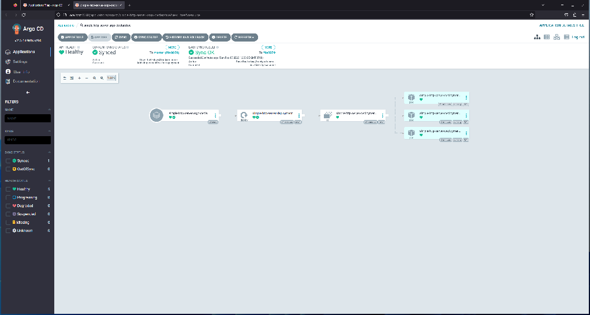

# Synchronize Automatically

In the last lab, you created an application in ArgoCD via Declarative Setup and left it not-yet-synchronized. In this lab, we're going to modify that application to synchronize automatically.

This will mean it will synchronize initially without having to do an explict sync operation and it means it will synchronize the state of the cluster with any changes we make to the manifest(s) in our infrastructure repository in the futuer.

## Adding automatic synchronization to the Declarative Setup Application Manifest

Configuring automatic synchronization is just altering the application. This can be done in the web interface and the command line interface. Because we've already gone as far as setting up an application with a manifest, we'll just modify that manifest and apply it again to update the application resource in the cluster.

The manifest we created in the prior lab had a `syncPolicy` element that looked like this:

``` yaml
syncPolicy:
  syncOptions:
  - CreateNamespace=true
```

This specified nothing more than that we wanted to let ArgoCD create the namespace in which to deploy our application if it's not already there.

Now, we want to modify this element to include automatic syncronization.

That looks like this (in the simplest form it can take):

``` yaml
syncPolicy:
  automated: {}
  syncOptions:
  - CreateNamespace=true
```

The whole manifest file should now look like this:

``` yaml
apiVersion: argoproj.io/v1alpha1
kind: Application
metadata:
  name: simple-http-server-argo-declarative
  namespace: argocd
spec:
  project: default
  source:
    repoURL: <Your Infrastrcture Repository URL>
    targetRevision: <The default branch in your repository>
    path: yaml-manifests
  destination:
    server: https://kubernetes.default.svc
    namespace: simple-http-server-argo-declarative
  syncPolicy:
    automated: {}
    syncOptions:
    - CreateNamespace=true
```

With this update saved in your file, you can now issue the same kubectl command again to apply this updated manifest:

```
kubectl apply -f declarative-application-development.yaml
```

Now, looking at the state of your applications should show all three of the applications as `Synced` and `Healthy`. You can see this in the web interface, the command-line interface, and/or with

```
kubectl get application -n argocd
```

The resources created should be the same as for the labs for creating the applciations with the web interface and the command-line interface. You should now have three different namespaces in your development cluster, each with a deployment, a replicaset, and a pod that are identical except for the namespace.

```
kubectl get namespaces
```

should now reveal that there's a new namespace we hadn't seen before - `simple-http-server-argo-declarative`. ArgoCd created the namespace when it synchronized automatically.

```
kubectl get deployment -n simple-http-server-argo-declarative
```

, 

```
kubectl get replicaset -n simple-http-server-argo-cli
```

and

```
kubectl get pod -n simple-http-server-argo-cli
```

will show the same resources you see in your browser and identical to the prior labs except for the namespace in which we have them running.

You can also try looking at the ArgoCD application resource with

```
kubectl get application -n argocd
```

You can see details of the application by using

```
argocd app get simple-http-server-argo-declarative
```

We've now created applications with ArgoCD in three different ways and configured one of them to synchronize automatically. 

## Update the Deployment Manifest to see automatic synchronization

To see the impact of automatic syncronization, let's now make a change to our infrastructure repository.

If you change your terminal context to your local infrastructure repository clone, you can modify the manifest we used, commit the updated state, and push your commit to the canonical server.

In the manifest file we've already been using in `yaml-manifests/simple-http-server-deployment.yaml`, find the first subelement of the `spec` element. It should be called `replicas` and have a value of `1` (if you haven't modified it since the lab where you created it).

``` yaml
spec:
  replicas: 1
```

Change the value for `replicas` from `1` to `3`. This property of a deployment tells Kubernetes how many pods to create in the deployment. In this case, that means that instead of running a single pod with a single container for this deployment, we instead want to run 3 pods with 1 container each, for a total of 3 containers. Each of these containers will be identical to one another and created from the same image. There will just be more of them after this change is applied.

``` yaml
spec:
  replicas: 3
```

The whole manifest will now look like this:

``` yaml
apiVersion: apps/v1
kind: Deployment
metadata:
  name: simple-http-server-deployment
spec:
  replicas: 3
  selector:
    matchLabels:
      app: simple-http-server
  template:
    metadata:
      labels:
        app: simple-http-server
    spec:
      containers:
      - name: simple-http-server
        image: ghcr.io/<GitHub organization>/simple-http-server
        ports:
        - containerPort: 8080
```

After you push this change to your remote repository, it will take up to a few minutes for ArgoCD to notice the change and automatically synchronize. This is because, by default, ArgoCD is using polling to look for changes to the Git repository that is the source of truth for an application. This can be updated to get notified by webhooks from your Git provider (like GitHub) so there's not a wait. Because we haven't done this, it can take a minute or two (the default polling interval is 3 minutes, so it can take up to that).

Note: You don't have to wait. In your browser in the web interface for ArgoCD, if you click `Refresh` for an application configured to automatically synchronize, either drilled into the application details or on the tile on the list of files for all applications, the sync will happen without the wait.

Once synchronized, you should be able to see in your browser and via kubectl that the replicaset created by the deployment has a target number of replicas of 3 and that 3 pods have been created and are now ready.

```
kubectl get all -n simple-http-server-argo-declarative
```

The output should look something like this:

```
pod/simple-http-server-deployment-f799db4f5-44kbw   1/1     Running   0          32m
pod/simple-http-server-deployment-f799db4f5-j4t8z   1/1     Running   0          4m14s
pod/simple-http-server-deployment-f799db4f5-rp8rq   1/1     Running   0          4m14s

NAME                                            READY   UP-TO-DATE   AVAILABLE   AGE
deployment.apps/simple-http-server-deployment   3/3     3            3           32m

NAME                                                      DESIRED   CURRENT   READY   AGE
replicaset.apps/simple-http-server-deployment-f799db4f5   3         3         3       32m
```

and the pods should show up in your browser, also.



This has demonstrated automatic sync.
