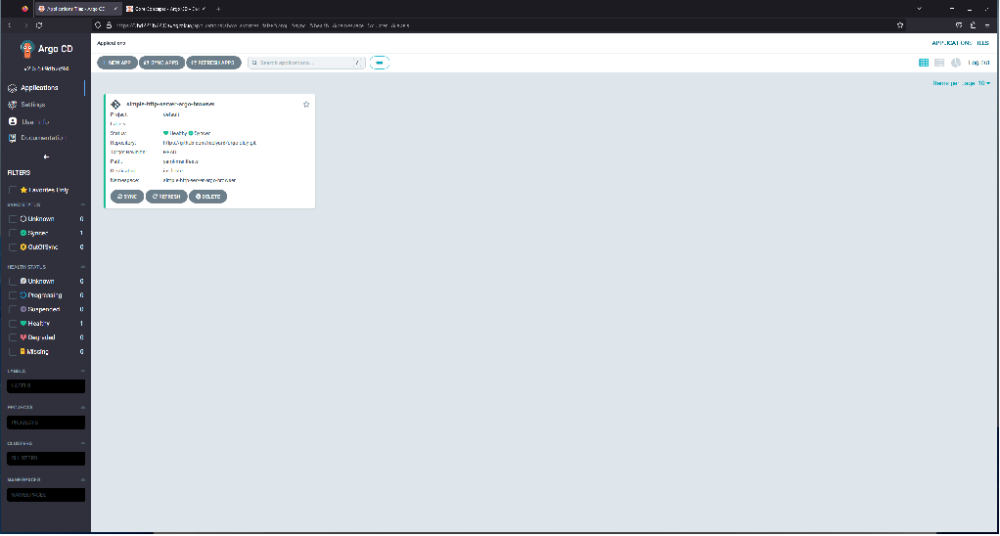

# Create an application in ArgoCD via the web user interface and synchorinize it

Now that we've seen the manual creation and deployment of an application, we'll start toward using Git as the source of record for the deployment of our application by using the same manifest we created in the last lab. We've already installed ArgoCD in the cluster in an earlier lab. Now, we'll use it.

## Using ArgoCD from your browser to set up a repository

ArgoCD uses Git as the source of truth for our application. To do this, it needs to have access to a Git repository. If your repository requires authentication for access, you'll need to set up a repository with a key or token to have access. Because we set up a public repository as the infrastructure repository, you don't need to do this as a separate step and can just include the public repository address in the setup of an application. If you'd like to see your instructor demonstrate using a private repository, ask for that.

## Using ArgoCD from your browser to set up an application

To get ArgoCD to synchronize a directory with YAML manifests into creating resoruces in our cluster, we need to create a resource from a custom resource definition, set up by ArgoCD, called an application. Later, we'll think about alternative ways we might create applications. For the moment, we'll use the ArgoCD user interface in the browser.

### Authenticating

First, we need to reach the application. Because you set up your development cluster to listen for ingress on port 8080 and installed ArgoCD to use ingress, you should be able to get to the site on http://localhost:8080. Try this and see if you get the ArgoCD user interface. Ask for help if you experience trouble.

You should arrive at the login page.


To log in, you need credentails. Use the username `admin` and get the default admin password from a secret ArgoCD created for you. There are many ways to set up authentication with ArgoCD, including using single sign-on with whatever provider you use in your organization. We'll not cover any of that. Instead, we'll just use this default `admin` user. To get the password, we'll use kubectl to talk to the cluster and extract the password from a secret in the cluster.

In bash, or another POSIX-compatible shell, use this:

``` bash
kubectl -n argocd get secret argocd-initial-admin-secret -o jsonpath="{.data.password}" | base64 -d
```

In Powershell, use this instead:

``` powershell
kubectl -n argocd get secret argocd-initial-admin-secret -o jsonpath="{.data.password}" | % {[Text.Encoding]::UTF8.GetString([Convert]::FromBase64String($_))}
```

With these two pieces of information, you'll be able to get into the user interface.

Before going further, you may want to change the password for your admin user to something you'll remember. Do this by clicking on `User Info` in the right-side menu and then clicking `Update Password`.

### Application Creation


Now that you're in, you can create an application.

Do that by clicking


In the space provided in the panel that appears, configure your new application. Use the following for input:

- Application Name: `simple-http-server-argo-browser`
- Project Name: `default` (tabbing to the input or clicking it will reveal this as the only value to select)
- Sync Policy: `Manual` (leave as default - for now)
- Sync Options: Check the `AUTO-CREATE NAMESPACE` box and leave the others blank
- Repsitory URL: `<Your Infrastrcture Repository URL>` (you can copy this from the GitHub, or other Git provider website and paste it here) (this should be a public repository/project if you want to reach it without authentication) (use the HTTPS clone URL)
- Revision: `<The default branch in your repository>` (this will usually be either `master` or `main`)
- Path: `yaml-manifests` (the name of the directory we created for YAML Kubernetes resource manifests)
- Destination: `https://kubernetes.default.svc` (tabbing to the input or clicking it will reveal this as the only value to select) (choosing this default value simply means "use the current cluster in which ArgoCD is running)
- Namespace: `simple-http-server-argo-browser`


With this information in place, click the `Create` button at the top of the panel.

Assuming you entered all the input validly, you should go back to seeing the applications view (the panel will go away), but now there will be one application tile showing, representing the aplication you just created.


Your application is currently in a state of

- Health: Missing
- Sync status: OutOfSync

## Using ArgoCD from your browser to synchronize an application

You can sychronize your application either by clicking the `Sync` button on the tile for the application from the applications page or by clicking on the application tile and going to the page for the application and clicking `Sync` there.

Either way, click the `Sync` button and then on the panel that appears click `Synchronize`.


After clicking the button, your application will synchronize. This should be very quick because we're only creating a small deployment and Kubernetes will create the resources associated with that quickly.

The statuses of the applciation should turn green, on both the tile on the applications page and on the drilled-in application page.




The green statuses now shown represent:

- Health: Healthy
- Sync status: Synced

Notice that the application page shows a set of resources, when we only created one in the manifest. This is expected. The deployment resource type is a complex type that creates more resources in fulfillment in a chain.

Essentially, the chain here is showing an ArgoCD `applciation` resource that caused the creation of a `deployment` resource that caused the createion of a `replicaset` resource that caused the creation of a `pod` resource.

All that said, we've now created an application in ArgoCD and synchronized a Git repository, as the source of truth for what we want in our cluster to a Kubernetes cluster. This synchronization operation has caused our application to "come to life" in our cluster.

In the coming labs, we'll build on this foundation and take things further by doing more with our application and with Kubernetes resources, automating synchronization, and interacting with ArgoCD in different ways.

For now, you should be able to see these resources have been created not only with the ArgoCD user interface, but also with kubectl.

```
kubect get namespaces
```

should now reveal that there's a new namespace we hadn't seen before - `simple-http-server-argo-browser`. ArgoCd created the namespace when we told it to synchronize.

```
kubectl get deployment -n simple-http-server-argo-browser
```

, 

```
kubectl get replicaset -n simple-http-server-argo-browser
```

and

```
kubectl get pod -n simple-http-server-argo-browser
```

will show the same resources you see in your browser.

You can also try looking at the ArgoCD application resource with

```
kubectl get application -n argocd
```

As you can see, ArgoCD is working by creating, managing, and showing resources in your Kubernetes cluster.

We'll do and see more in the following labs.
