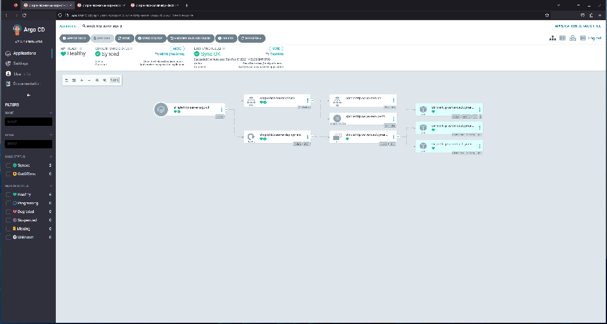

# Create a Kubernetes service to expose the application

Thus far, we've created a manifest with a deployment resource and we've applied it to our cluster manually, and created ArgoCD applications to apply it.

Tbis has been useful to see resources created in a cluster. We haven't, though, been able to do anything with our application beyond seeing that it's running in pods in a cluster.

To take things a step further, we'll add a service to our cluster to expose the deployment we've created.

## Adding a manifest to create a service

Deployments in Kubernetes are useful for running containerized workloads in a cluster that orchestrates the application, built into container images, into running for useful purposes.

The sample application we've created is useful because it responds to HTTP requests for which it is listening.

So far we haven't made any attempt to communicate with our application via HTTP. If we think about doing that, we run into a problem. How do we access the webserver in the containers running the pods of our deployment?

Kubernetes has a type of resource called `Service` with the purpose of exposing a port or ports on a deployment with a load-balancing strategy, either only within the cluster or to the world outside the cluster.

Let's start, in our infrastructure repository, with creating a manifest for such a resource. Create a file, as a sibling to our deployment manifest, in the `yaml-manifests` directory.  This file will have a path and filename, from the root of your infrastructure repository of `yaml-manifests/simple-http-server-service.yaml`.

Add the following content to this file:

``` yaml
apiVersion: v1
kind: Service
metadata:
  name: simple-http-server-service
spec:
  selector:
    app: simple-http-server
  ports:
  - name: http
    port: 80
    targetPort: 8080
  type: ClusterIP

```

If you commit this file to your repository and push to your remote and a sync happens (either because of polling or because of clicking `Refresh` or `Sync`), a service will be created in the cluster.



```
kubectl get service -n simple-http-server-argo-declarative
```

This will show that a service has been created with a type of `ClusterIP` and it gives an IP address that can be used to access the service from within the cluster. If you want to try this, you could use `kubectl exec` to get an interactive session in a container in a pod in the cluster (either one already running there, or one you create just for this purpose) and use that ip to access the service. Doing this will be left as an optional exercise without instructions. If you'd like to have your instructor demonstrate this, feel free to ask.

Instead of accessing the service from within the cluster (or in addittion to it if you've chosen to attempt that), we'll use kubectl's ability to forward a port from the host into the cluster to a service to access this service from your workstation.

To expose this service to your machine via port forwarding, issue this command:

```
kubectl port-forward service/simple-http-server-service -n simple-http-server-argo-declarative 8888:80
```

You should now be able to reach the application from your host machine on `http://localhost:8888`. You can try requesting this address with your browser and/or with cUrl.

```
http://localhost:8888
```

In either case, the Golang code we wrote and built into the image from which the containers were created that are running in our cluster will respond to this request with `Hello, World!`.

We have now closed the loop and confirmed that what is running in our cluster is indeed the image we built from our code.

Port forwarding will only work, though, as long as the kubectl process is running that created the port forward. In the next lab, we'll create something more durable and continue creating a more fully-featured application.
